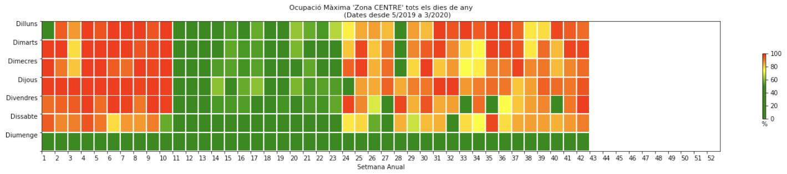

[![header][header-url]][header-link]

## PROJECTS

* ### Deep Learning Image retrieval for Fashion Product database

The aim of the project is the creation of a tool that allows the full implementation and evaluation of an image retrieval web application using the Fashion Product dataset as the database. Several existing pre-trained models are evaluated and also custom models are created from applying Transfer Learning from them.

The main idea is that a user can obtain the topK ranking products more similar to an image using one of the different models available.

[Project Link](https://github.com/ferran-candela/upc-aidl-2021-image-retrieval)

* ### Analyzing and predicting parking occupartion in different city areas (Private - Company Project)
The objective of the project is to analyze and predict the occupation of the green and blue areas of a city based on data provided by sensors installed in the city

  
   

<!-- Markdown link & img dfn's -->

[header-url]:  images/portfolio_img.png
[header-link]: https://github.com/jordimonta
[retrievalsys-image]: images/frontend-example-t-shirt-product_fashion.gif