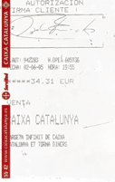

[![header][header-url]][header-link]

## PROJECTS

* ### Deep Learning Image retrieval for Fashion Product database

The aim of the project is the creation of a tool that allows the full implementation and evaluation of an image retrieval web application using the Fashion Product dataset as the database. Several existing pre-trained models are evaluated and also custom models are created from applying Transfer Learning from them.

The main idea is that a user can obtain the topK ranking products more similar to an image using one of the different models available.

[Project Link](https://github.com/ferran-candela/upc-aidl-2021-image-retrieval)

* ### Analyzing and predicting parking occupartion in different city areas 
(Private - Company Project)
 
The objective of the project is to analyze and predict the occupation of the green and blue areas of a city based on data provided by sensors installed in the city.
BIG DATA project.

   
  

* ### Choosing the best algorithm to apply to an image to improve its quality 
(Private - Company Project)
  
The method based on "Image retrieval system" allows us to choose the best algorithm based on the similarity between images and their features.
The execution in milliseconds (CPU) is perfect for solutions in real time.

* ### Image quality improvement for OCR systems 
(Private - Company Project)
  
The aim of the project is to develop  an algorithm that solves problems related with the non-uniform lighting (flash and shadow) for the improvement of OCR (Optical Character Recognition) systems.
Scanned document images often have various defects, background noise, damaged areas, bleeding, and uneven background illumination. In this algorithm we mainly focus on non-uniform lighting, shadows and flash, which are often present in the document and influence the final visual quality and OCR accuracy.

   
  

<!-- Markdown link & img dfn's -->

[header-url]:  images/portfolio_img.png
[header-link]: https://github.com/jordimonta
[retrievalsys-image]: images/frontend-example-t-shirt-product_fashion.gif